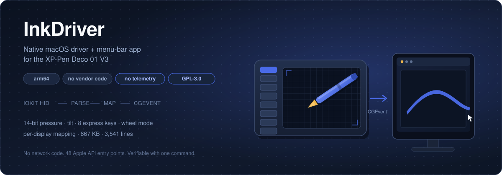
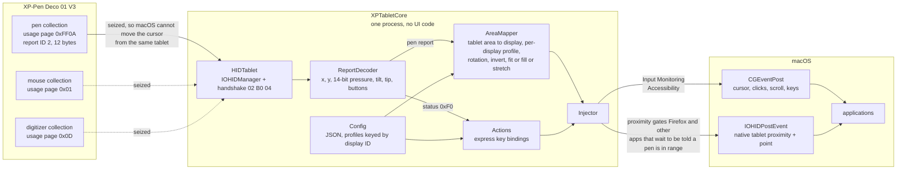
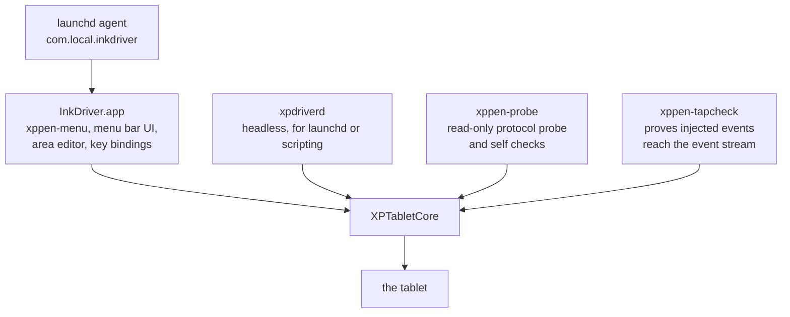

# InkDriver: native arm64 driver + menu-bar app for the XP-Pen Deco 01 V3

A from-scratch, open-source macOS driver for the **XP-Pen Deco 01 V3**:
**native arm64, no Rosetta, no vendor code, no third-party dependencies, no
telemetry, no network access.** Uses only IOKit (to read the tablet) and
CoreGraphics (to inject events).

- **Requirements:** macOS 14+, Xcode command line tools. Apple Silicon or Intel.
- **Size:** the whole app is under 1 MB; the headless driver is ~420 KB.
- **Nothing to configure to get started**: it finds the tablet, maps it to your
  main display and works. Everything else is optional.

| What you get | |
| --- | --- |
| Pen | position, 14-bit pressure, tilt, both barrel buttons |
| Pressure test | a live view in the app: draw on the tablet, watch line width follow pressure, with raw hardware pressure graphed against what applications receive |
| Express keys | 8 keys, each bindable to any of the vendor's actions, or a shortcut you record |
| Wheel mode | hold a key and move the pen to scroll, 1:1 with no acceleration |
| Mapping | stretch / keep-proportions / custom screen area / all displays, rotation, invert |
| Multiple monitors | per-display settings, switch displays from a bound key |
| Menu bar app | full settings window, JSON config, starts at login |

## Why this exists

- The original driver was buggy for me: shortcuts fired unexpectedly and it clashed with other input software.
- I watched it send traffic to XP-Pen servers (`data.tr.x-pen.com.cn`, `driverinfo.xp-pen.com.cn`). The collection path is off by default in 4.0.18, but that is not knowable from outside.
- Privacy by construction: no network API is imported at all, so there is no switch to trust.
- I wanted to audit it. 3,541 lines, 48 Apple API entry points, readable in one sitting.
- No source ships with the vendor driver, so nothing can be fixed when it breaks.
- Hardware outlives support. The tablet works; the software around it will not be updated forever.
- I wanted to know what the device actually sends, not what a copied config file claims.
- Settings should be a file I own, not proprietary XML only the vendor's GUI can write.
- 102 MB, three background processes and a Qt runtime, for one tablet.

## How it compares

| | XP-Pen 4.0.18 | InkDriver |
| --- | ---: | ---: |
| Installer | 54 MB | **272 KB** |
| Installed on disk | ~102 MB | **867 KB** |
| Background processes | 3 | **1** |
| Network APIs imported | yes | **none** |
| Apple API entry points used | hundreds, across a 27 MB Qt binary | **48** |
| Source available | no | **all 3,541 lines** |

The whole API surface the driver can use is CoreGraphics, IOKit's HID manager,
`AXIsProcessTrusted`, CoreFoundation's run loop, and libc: 48 entry points, no
socket, no URL session, no hostname or serial-number lookup, and no event tap.
That is verifiable in one command:

```sh
otool -Iv .build/release/xpdriverd | grep '^0x' | awk '{print $NF}' \
  | sed 's/^_//' | grep -vE '^\$|^swift_|^_swift|^__|^_Block|^_NSConcrete|^LOCAL' | sort -u
```

See **[COMPARISON.md](COMPARISON.md)** for the full breakdown, including an honest
list of what the vendor driver does that this one does not.

### Performance

Measured on the same machine, tablet, browser and test page, with the same validated
instrument for both drivers. Full method and caveats in
**[docs/BENCHMARKS.md](docs/BENCHMARKS.md)**.

| | InkDriver | XP-Pen | 
| --- | ---: | ---: |
| CPU idle | **0.077% of a core** | 1.61% |
| CPU while drawing | **77 to 84 ms per second** | 98 to 109 ms |
| Memory idle | **84 MB** | 202 MB |
| Memory while drawing | **76 MB** | 166 to 424 MB |
| App bundle | **1.2 MB** | 100 MB |
| Bundled frameworks | **none** | 10 Qt frameworks |
| Pen events delivered | 62/s, 16 ms median | 62/s, 16 ms median |

Roughly 21x less CPU when idle, about 20% less while drawing, and 2.4x less memory,
with an identical delivered event stream: same rate, same interval distribution, no
spikes either way. Both drivers run natively, so this is not a Rosetta effect.

The 16 ms delivery cadence is the 60 Hz display refresh, not a driver property: the
browser coalesces pointer movement to vsync, which is what makes it a fair common
yardstick for the load both drivers were under.

End-to-end input latency is **not** measured here, and no claim is made about it.
Both drivers produce the same interval distribution, which says neither adds jitter
the other lacks, and that is the extent of what the data supports.

### Accuracy

`.build/release/xppen-probe --check-accuracy` verifies the transforms arithmetically:
the mapping is exactly affine, covers the target area with no error, never escapes
the display, and keeps all 16384 pressure levels with no loss. Details in
**[docs/ACCURACY.md](docs/ACCURACY.md)**.

One real deviation, measured on hardware and inherited from the vendor: tilt is
divided by 84 while Apple's convention makes 1.0 equal 90 degrees, so a maximum
physical tilt of 60 degrees arrives as 64. Set `"tiltScale": 90.0` for true degrees,
or leave it at the default 84 for exact vendor parity.

```json
"tiltScale": 84.0, "invertTiltX": false, "invertTiltY": false,
```

## Status

**Working, and verified against real hardware.** The protocol was measured with
`xppen-probe`, cross-checked against the vendor driver's own code, and the event
path was proven with `xppen-tapcheck` (a posted event arrives at a session event
tap as `subtype=1 tablet=(12345,6789) pressure=0.5000 tilt=(0.250,0.000) buttons=1`).

| Feature | State |
| --- | --- |
| Pen position, pressure (14-bit), tilt, both barrel buttons | working |
| 8 express keys, each bindable to a catalogue action | working |
| Wheel mode: hold a key and move the pen; 1:1 pixel scroll, no acceleration | working |
| Mapping: stretch / fit (keep proportions) / custom screen area / all displays, rotation, invert | working |
| Screen switching: cycle displays from a bound key, each with its own mapping | working |
| Per-display profiles, keyed by display ID | working |
| Adding/removing/reordering monitors needs no reconfiguration | working |
| Virtual display-layout editor showing where the tablet lands | working |
| Menu-bar UI + JSON config | working |
| Eraser | status bits not yet observed on hardware |
| LED / battery / touch ring / BLE | not applicable to this model, or not implemented |

See [docs/PROTOCOL.md](docs/PROTOCOL.md) for the measured protocol.

## Architecture

Third-party kernel extensions cannot load on Apple Silicon, and a DriverKit HID
extension needs an entitlement only Apple grants, so a native driver is
necessarily a userspace process, the same shape the vendor driver uses.

```
tablet ──USB HID──> IOHIDManager ──parse──> coordinate map ──> CGEventPost ──> apps
                              (Input Monitoring)                (Accessibility)
```

In full, with the three HID collections the device exposes, the two separate
injection paths, and where macOS asks for permission:



Why two injection paths, since it looks redundant: `CGEventPost` can carry a mouse
event with a tablet *subtype* and that is enough for Chromium and native AppKit
applications, but it cannot create a real tablet event, and Firefox ignores tablet
data until it has seen one. See `docs/POST-MORTEM-FIREFOX-PEN.md`.

The pipeline above lives in one target, and every front end runs the same code:



`XPTabletCore` holds the whole driver and has no UI or CLI concerns, so the
menu-bar app and the headless CLI run exactly the same code:

| Target | Purpose |
| --- | --- |
| `XPTabletCore` | protocol, HID, mapping, event injection, config, driver core |
| `xppen-menu` | the menu-bar app (installed as `InkDriver.app`) |
| `xpdriverd` | headless driver, for launchd or scripting |
| `xppen-probe` | read-only protocol probe |
| `xppen-tapcheck` | verifies injected events reach the event stream |

## Build and install

Requires the Xcode command line tools. No .NET, no Rosetta.

```bash
make app            # builds InkDriver.app
make install-app    # copies to ~/Applications and registers a login agent
make install        # CLI tools into ~/.local/bin
```

The app name and bundle id are two variables at the top of the `Makefile`
(`APP_NAME`, `BUNDLE_ID`).

### Signing, and why your permissions kept vanishing

An **ad-hoc signed** app has no stable code identity: macOS keys the TCC grant
(Input Monitoring, Accessibility) on the code hash, so every rebuild looks like a
new app and the permissions are silently dropped:

```
Failed to match existing code requirement for subject … and service kTCCServicePostEvent
```

`Support/make-signing-identity.sh` creates a one-time self-signed code-signing
certificate, and the build signs with it. The requirement then becomes

```
identifier "com.local.inkdriver" and certificate leaf = H"5497…"
```

which survives rebuilds, so you grant the permission once.

### Permissions

| Permission | Needed for | Symptom without it |
| --- | --- | --- |
| **Input Monitoring** | opening the tablet's HID interface | `failed to open the tablet` |
| **Accessibility** | posting synthetic events | driver runs, cursor never moves |

The app logs its own TCC state at launch, so this is never a mystery:

```
[09:37:53] accessibility: granted
[09:37:54] seized digitizer[page=0xd usage=0x2]
[09:37:54] handshake sent: 02 B0 04
[09:37:54] tablet connected
```

## Configuration

Everything lives in one JSON file, written on first run and editable from the
menu bar:

```
~/Library/Application Support/xppen-driver/config.json
```

```json
{
  "workspace": {
    "displayID": 724053248,
    "switchDisplayIDs": [],
    "profiles": {
      "724053249": { "mode": "fit", "rotation": 90, "invertX": false, "invertY": false,
             "screenRect": { "x": 0.0, "y": 0.0, "width": 1.0, "height": 1.0 },
             "tabletRect": { "x": 0.0, "y": 0.0, "width": 1.0, "height": 1.0 } }
    },
    "mode": "stretch",
    "screenRect": { "x": 0.0, "y": 0.0, "width": 1.0, "height": 1.0 },
    "tabletRect": { "x": 0.0, "y": 0.0, "width": 1.0, "height": 1.0 },
    "rotation": 0,
    "invertX": false,
    "invertY": false
  },
  "tiltScale": 84.0, "invertTiltX": false, "invertTiltY": false,
  "penDownPressureThreshold": 1,
  "sendHandshake": true, "seizeFallbackInterfaces": true,
  "scrollSensitivity": 1.0, "scrollInvertX": false, "scrollInvertY": false,
  "penButton1": "mouse:right",
  "penButton2": "wheel",
  "expressKeys": ["none", "none", "none", "none", "none", "none", "none", "none"]
}
```

### Mapping

| `mode` | Behaviour |
| --- | --- |
| `stretch` | fill the target display; X and Y scale independently, so circles can become ellipses |
| `fit` | largest rectangle inside the display that keeps the tablet's proportions, centred, so round stays round |
| `custom` | map onto `screenRect`, an arbitrary rectangle inside the target display |
| `allDisplays` | treat every active display as one big surface |

- `screenRect` and `tabletRect` are normalised (0…1). `tabletRect` restricts the
  active *tablet* surface; `screenRect` picks the target rectangle on screen.
- `rotation` is 0 / 90 / 180 / 270.
- `switchDisplays` lists the displays the **Switch monitor** action cycles
  through. Empty means every active display, in order. Bind any pen button or
  express key to *Switch monitor* (vendor action 102) to use it.

### Per-display settings, and why displays are keyed by ID

`profiles` holds one entry per display, keyed by **`CGDirectDisplayID`** rather than
by position in the active-display list. Anything a display does not override falls
back to the shared top-level fields.

An index is not a stable identity: attaching a monitor before an existing one
renumbers everything, so index-keyed settings silently migrate onto the wrong
screen. A display ID is stable for as long as that display is connected.

The practical consequences:

- **Adding a monitor needs no configuration.** It appears in the list and the
  layout view, uses the shared defaults, and is included in screen switching.
- **Removing one is harmless.** Its settings are ignored, the others keep theirs,
  and if it was the targeted display the driver falls back to the first available.
- **Reordering does nothing.** Settings follow the display, not the slot.
- The app re-reads the display list on
  `NSApplication.didChangeScreenParametersNotification`, and the driver exposes
  `refreshDisplays()`.

This matters when displays differ in shape: a landscape 5K beside a portrait 4K
wants a different rotation and mode each. Changing any setting while a display is
targeted gives it its own profile; *Use shared defaults* removes it again.
`switchDisplayIDs` is the same idea for the Switch-monitor cycle.

**Migration.** A config written before display-ID keying is rewritten once, on
startup, using the live display list. The subtlety is that index keys are not
distinguishable from display IDs by inspection alone: real display IDs on macOS
are often small numbers, so an index `"1"` can look exactly like a display ID
`1`. A config with no `displayID` (or with a legacy index list) is therefore
treated as index-keyed, and one that has a `displayID` is treated as ID-keyed.
Stale entries for displays that are not connected are dropped rather than left to
resurface on an unrelated monitor.

Tolerant decoding: every key is optional, so an older or hand-edited config file
still loads and simply contributes fallback values.

The numbers are checkable without hardware:

```bash
.build/release/xppen-probe --check-workspace
```

which prints the target rectangle and the mapping of all four tablet corners for
every mode, plus the rotations.

A pre-workspace config file (flat `display` / `areaScale` / `areaOffsetX` /
`areaOffsetY` / `rotation` / `invertX` / `invertY` keys) is migrated
automatically and keeps working unchanged.

Bindings accept a canonical form (`mouse:right`, `double:left`, `scroll:up`,
`key:8+cmd`, `wheel`, `eraser`, `panel`, `monitor`, `precision`,
`action:210`) or any name from the vendor catalogue. `xppen-probe
--check-bindings` prints the whole table plus the action IDs.

`wheel` is hold-to-scroll: while the bound key is held, each report scrolls by
exactly the distance the pen moved (1 point of pointer movement = 1 pixel of
scroll, no acceleration), sub-pixel movement is carried to the next report, and
the cursor stays where it was because no move events are posted.

## Bring-up / debugging

```bash
.build/release/xppen-probe --descriptor        # HID report descriptors
.build/release/xppen-probe --watch --init      # stream decoded reports
.build/release/xppen-probe --check-bindings    # config parser + action table
.build/release/xppen-probe --check-workspace   # tablet -> screen mapping maths
.build/release/xppen-probe --check-pressure    # contact decision, pressure and tilt
.build/release/xppen-presscheck                # whether applications receive pressure
.build/release/xpdriverd --dry-run             # exercise the parser, inject nothing
.build/release/xppen-tapcheck --inject-test    # prove event injection end to end
```

## Troubleshooting

| Symptom | Cause |
| --- | --- |
| `no tablet found` | another driver holds the interface: `pgrep -fl 'XPPen\|XTouchDriver\|PenTabletInfo'` |
| `failed to open the tablet` | Input Monitoring not granted to this binary |
| Cursor moves but nothing logs, or everything is doubled | macOS is also reading the tablet: the fallback mouse/digitizer interfaces must be seized |
| Cursor drifts on its own | same as above: `seizeFallbackInterfaces` |
| **Pen freezes after clicking the menu bar** | HID was registered for `kCFRunLoopDefaultMode` only; opening a menu runs AppKit's event-tracking loop, which is a *different* mode. Must be scheduled on `kCFRunLoopCommonModes` |
| Driver runs, cursor never moves | Accessibility not granted, or granted to a stale copy |
| Pen clicks or draws while hovering | contact was derived from pressure. The sensor leaks while hovering (877 measured on this unit) and the tip-down range starts at 13, so the two overlap and only the tip switch can separate them |
| Cursor moves, no pressure in apps | `kCGMouseEventSubtype` not set to 1 (`TabletPoint`), or pressure written only to `kCGTabletEventPressure`. AppKit and the browsers read `NSEvent.pressure`, which comes from `kCGMouseEventPressure`. Check with `xppen-presscheck` |
| No pen in Firefox, everything else fine | **Fixed.** See `docs/PROTOCOL.md` for the layout detail. Previously: Firefox sets its pen flag only from `tabletProximity:`, which AppKit raises only for a native `NSTabletProximity` event. A CGEvent with that subtype arrives as a plain `mouseMoved` instead (measured), and `IOHIDPostEvent` produces no such event on this macOS (measured). Earlier details: Firefox reports `pointerType: "mouse"` and pressure `0`/`0.5` from our events, while the same Firefox instance reports `pen` with 47 distinct pressure values from the vendor's, measured with an identical harness. Our proximity event reports the same `pointingDeviceType`, capability mask and vendor/tablet ids as the vendor's, so the difference is not yet identified. See docs/PROTOCOL.md |
| No pressure in Firefox | Firefox ignores tablet data until told a pen is in range, by a mouse event with subtype 2 (`TabletProximity`) carrying the proximity fields. The driver sends that when the pen **enters range**, so with Firefox already focused, lift the pen clear of the tablet and bring it back |
| No pressure in a browser, but pressure in a native app | the same thing, from the other direction: browsers always use `NSEvent.pressure`, so the mouse pressure field is not optional |
| Pressure appears in apps when the pen is nowhere near | `zeroPressureOnHover` is off, so the hover leakage is passed through |
| Pressure maxes out at half | pressure is 14-bit (`report[6] \| report[7]<<8`); the vendor's `& 0x1f` mask is for other models |

## Design notes

- **Contact comes from the tip switch, never from pressure alone.** The tablet
  reports pressure while merely hovering: 877 at the top of the range, against a
  tip-down minimum of 13. Those overlap, so "pressure above a floor" cannot
  distinguish touching from hovering and produces phantom clicks.
  `penDownPressureThreshold` can only make contact *harder* (tip switch **and**
  pressure), never easier, and defaults to 0.
- **The tablet is re-armed while idle.** It drops out of tablet mode on its own
  after a period without pen activity, and then reports nothing at all until the
  `02 B0 04` mode command is sent again. Measured with `xppen-probe --watch`, with
  and without `--init`, on an otherwise idle device. Silence is not treated as
  proof of a fault, because an idle tablet is silent by design; the handshake is
  simply repeated every two seconds while nothing is arriving, which costs one
  small output report.
- **Pressure is written to two fields.** `kCGTabletEventPressure` carries it for
  consumers that read tablet data, and `kCGMouseEventPressure` because that is the
  field AppKit turns into `NSEvent.pressure`, which is what applications and every
  browser read. Writing only the first leaves web drawing apps with no pressure.
- **Hover leakage is not passed to applications.** `zeroPressureOnHover`
  (default on) reports zero pressure unless the pen is in contact, so no app sees
  the sensor reading as pressure while you hover.
- **MacOS also consumes the tablet's fallback interfaces.** Without the seize the
  pointer moves independently of the driver; measured ~900 stray events in 6 s.
- **Tilt is divided by 84.0** to match the vendor exactly; the sensor's own range
  is ±60. Set `tiltScale` to 60 for a full-range signal.

## Licence

**GNU General Public License v3.0 or later**. See [LICENSE](LICENSE). Each source
file carries an `SPDX-License-Identifier: GPL-3.0-or-later` tag.

In short: use it, study it, change it and share it, but if you distribute a modified
version, it has to stay free software under the same terms, with source. That is
the point: a driver that a manufacturer can drop should not be one that a user
cannot pick up. If you fix something for your own tablet, the next person gets it.

`GPL-3.0-or-later` was chosen over `GPL-2.0-only` for compatibility: the main
other implementation for this hardware, OpenTabletDriver, is LGPL-3.0, and LGPL-3.0
code can be combined with GPL-3.0 work. Nothing from it is included today, but the
door stays open.

### Provenance

No vendor code and no OpenTabletDriver code is included. What this project uses
are **measured facts about the hardware**: HID report layouts, a handshake byte
sequence, coordinate ranges, and the CoreGraphics event field numbers, all
obtained by observation and documented with their evidence in
[docs/PROTOCOL.md](docs/PROTOCOL.md). Facts about a device are not creative
expression; the implementation here is independent and freely licensed.

## Status of this repository

This is the driver as a standalone project. It has no build-time or runtime
dependency on anything outside Apple's frameworks.

Renaming: the executable targets are prefixed `xppen-` because they talk to XP-Pen
hardware, which is ordinary nominative use. If you would rather not use the
manufacturer's name, the `Package.swift` target names, the `Makefile` variables
and the `Support/*.in` templates are the only places it appears.
